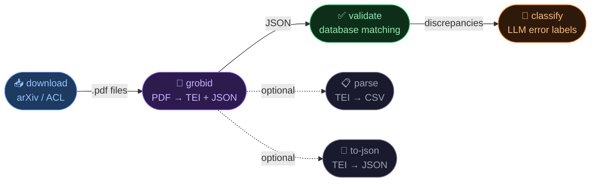

# Academic Paper Processing Toolkit

## Scientific abstract
This repository operationalizes the empirical analysis pipeline used in *Making a Name for Myself: On Academic Naming Policies and their Impact* (FAccT 2026). In the paper’s mixed-method design, this codebase covers the large-scale citation-analysis branch (not the survey/interview branch). The goal is to measure how often cited author names diverge from authoritative records across major computer-science venues and years. We first construct a citation evidence base from paper PDFs, then compare cited names against trusted bibliographic sources (DBLP, ACL Anthology, arXiv) to detect discrepancies at scale. The resulting outputs support quantitative analyses of citation-name errors and downstream error characterization.

## Quickstart
Minimal end-to-end run (macOS/Linux):

```bash
# 1) Stage-1 environment
python3.11 -m venv .venv
source .venv/bin/activate
pip install -r requirements.txt

# 2) Required DBLP source for validation
mkdir -p data
curl -L -o data/dblp.xml.gz https://dblp.org/xml/dblp.xml.gz
gunzip -f data/dblp.xml.gz

# 3) Download PDFs (arXiv + ACL)
python -m src.pipeline download --source both --output-dir data/arxiv_pdfs --acl-output-dir data/acl_pdfs

# 4) Start GROBID (Terminal A)
docker run --rm --init -p 8070:8070 grobid/grobid:0.8.0

# 5) Run GROBID extraction (Terminal B)
source .venv/bin/activate
export GROBID_URL=http://localhost:8070/api
python -m src.pipeline grobid --input-dir data/arxiv_pdfs --output-dir data/outputs/arxiv_pdfs

# 6) Stage-2 environment + validation
python3.10 -m venv .venv310
source .venv310/bin/activate
pip install -r requirements.txt
pip install retriv
python -m src.pipeline validate \
  --input-dir data/parsed_jsons \
  --dblp-xml data/dblp.xml \
  --sources dblp,acl,arxiv \
  --similarity-method damerau \
  --output-dir data/results
```

## Two-stage methodology intent
- **Stage 1 - Citation evidence construction**: build a reproducible citation corpus from venue PDFs so author-name mentions are available in a consistent machine-readable form for analysis.
- **Stage 2 - Discrepancy measurement and attribution**: compare cited names against authoritative bibliographic records to quantify name-related citation errors across venues/years and prepare outputs for detailed error analysis (including optional LLM-assisted categorization).

All commands are exposed via one CLI: `python -m src.pipeline ...`.

## Step-by-step Setup
Follow this sequence once, then run the stage commands as needed.

### 1) Create your Python environment(s)
Use two environments:
- `.venv` (Python 3.11) for Stage 1 (`download`, `grobid`, `parse`, `to-json`) and optional LLM classification.
- `.venv310` (Python 3.10) for Stage 2 validation with `retriv`.

Windows:
```bash
py -3.11 -m venv .venv
. .venv/Scripts/activate
```

macOS/Linux:
```bash
python3.11 -m venv .venv
source .venv/bin/activate
```

Install dependencies:
```bash
pip install -r requirements.txt
```

Optional extras:
```bash
# ACL Anthology downloader support
pip install -r requirements.txt -r requirements-acl.txt

# LLM classification support
pip install -r requirements.txt -r requirements-llm.txt
```

Backend behavior for classification:
- Linux: uses `vllm` when available.
- macOS/Windows: automatically falls back to `transformers`.

Create `.venv310` for validation:

Windows:
```bash
py -3.10 -m venv .venv310
. .venv310/Scripts/activate
pip install -r requirements.txt
pip install retriv
python -c "from retriv import SparseRetriever; print('retriv ok')"
```

macOS/Linux:
```bash
python3.10 -m venv .venv310
source .venv310/bin/activate
pip install -r requirements.txt
pip install retriv
python -c "from retriv import SparseRetriever; print('retriv ok')"
```

### 2) Initialize data sources
Download the DBLP XML dump (required for Stage 2 validation):
```bash
mkdir -p data
curl -L -o data/dblp.xml.gz https://dblp.org/xml/dblp.xml.gz
gunzip -f data/dblp.xml.gz
```

Optional: scrape DBLP conference pages.

Basic run:
```bash
python -m src.citation_extraction.dblp_scraper --output-dir data/dblp_conferences
```

Year-filtered run:
```bash
python -m src.citation_extraction.dblp_scraper \
  --start-year 2015 \
  --end-year 2025 \
  --output-dir data/dblp_conferences \
  --delay 2.0
```

### 3) Stage 1: Build citation evidence from PDFs
Download PDFs.

arXiv only:
```bash
python -m src.pipeline download --source arxiv --output-dir data/arxiv_pdfs
```

ACL only (titles already on arXiv are skipped by default):
```bash
python -m src.pipeline download --source acl --acl-output-dir data/acl_pdfs
```

Both sources in one command:
```bash
python -m src.pipeline download --source both --output-dir data/arxiv_pdfs --acl-output-dir data/acl_pdfs
```

Run GROBID (only needed for this step).

Install Docker Desktop if needed (example for macOS/Homebrew):
```bash
brew install --cask docker
```
Then open Docker Desktop once so the daemon is running.

Terminal A (start GROBID server):
```bash
source .venv/bin/activate
docker run --rm --init -p 8070:8070 grobid/grobid:0.8.0
```

Terminal B (run pipeline against local GROBID):
```bash
source .venv/bin/activate
unset GROBID_URL
export GROBID_URL=http://localhost:8070/api
curl -sS http://localhost:8070/api/isalive
python -m src.pipeline grobid --input-dir data/arxiv_pdfs --output-dir data/outputs/arxiv_pdfs
```

Optional (same command family): automatic reference-parser dataset/split/eval
is run after `pipeline grobid` when gold BibTeX files are available.
Default workspace:
- `data/grobid_finetune/gold_bibtex/` (input gold `.bib` / `.bibtex`)
- `data/grobid_finetune/dataset/` (matched pairs + 80/10/10 splits)
- `data/grobid_finetune/reports/` (macro field-level F1 report)
- `data/grobid_finetune/runs/` (reproducibility metadata)

If needed, disable this optional workflow:
```bash
python -m src.pipeline grobid --no-reference-training-pipeline
```

If you already have a fine-tuned GROBID config, register it for automatic fallback:
```bash
python -m src.pipeline grobid --finetuned-config-path path/to/config.json
```

Parse TEI XML to tabular metadata:
```bash
python -m src.pipeline parse \
  --input-dir data/outputs/arxiv_pdfs \
  --pattern "**/*.grobid.tei.xml" \
  --output-csv data/arxiv_metadata.csv
```

Optional: export TEI XML to JSON manually.
`grobid` already exports JSON by default. Run this only if you skipped JSON export or want to regenerate it:
```bash
python -m src.pipeline to-json --input-dir data/outputs/arxiv_pdfs --output-dir data/parsed_jsons
```

### 4) Stage 2: Measure name discrepancies against authoritative sources
Activate `.venv310` (created in Step 1):
```bash
source .venv310/bin/activate
```

Run validation:
```bash
python -m src.pipeline validate \
  --input-dir data/parsed_jsons \
  --dblp-xml data/dblp.xml \
  --sources dblp,acl,arxiv \
  --similarity-method damerau \
  --output-dir data/results
```

Notes:
- If `dblp` is included in `--sources`, `data/dblp.xml` is required.
- If `acl` is included in `--sources`, install optional ACL deps: `pip install -r requirements.txt -r requirements-acl.txt`.
- Similarity is configurable via `--similarity-method` (`fuzz` / `fuzz.ratio` / `damerau`).

### 5) Optional: LLM mismatch classification
Use `.venv` (or another environment with `requirements-llm.txt` installed):
```bash
source .venv/bin/activate
pip install --upgrade -r requirements.txt -r requirements-llm.txt
python -m src.pipeline classify \
  --input_file data/results/validation_results.json \
  --output_file data/results/classified_results.json
```

Force the transformers backend explicitly:
```bash
python -m src.pipeline classify --backend transformers --transformers_device auto
```

## Pipeline overview



| Step | Command | Module | Output |
|------|---------|--------|--------|
| 1 | `pipeline download` | `arxiv_fetcher` / `acl_fetcher` | `data/arxiv_pdfs/` |
| 2 | `pipeline grobid` | `grobid_runner` | `data/outputs/…/*.tei.xml` + `data/parsed_jsons/` |
| 3 | `pipeline validate` | `validate_citations` + source adapters (`dblp`/`acl`/`arxiv`) | `data/results/validation_results.json` |
| 4 ✦ | `pipeline classify` | `vllm_classifier` | `data/results/classified_results.json` |
| — ✦ | `pipeline parse` | `grobid_parser` | `data/arxiv_metadata.csv` |
| — ✦ | `pipeline to-json` | `tei_to_json` | `data/parsed_jsons/` |

✦ optional &nbsp;·&nbsp; Steps 1–2 require a running GROBID server &nbsp;·&nbsp; Step 3 requires `data/dblp.xml` when `dblp` source is enabled

## Repository map (roles)
```
src/pipeline.py                     # CLI entrypoint
src/citation_extraction/            # Stage 1: PDF -> TEI/TSV
  grobid_runner.py
  grobid_parser.py
  reference_parser_training.py      # optional dataset/split/eval orchestration
  dblp_scraper.py
src/name_matching/                  # Stage 2: DB lookups & validation
  api_caller.py
  analyze_matches.py
  validate_citations.py
  sources/                          # DBLP / ACL / arXiv source adapters
src/models/                         # Optional LLM classification
  acl_fetcher.py
  arxiv_fetcher.py
  prompt.py
  vllm_classifier.py
src/parser/dblp_parser.py           # Shared DBLP utilities
examples/                           # Demos & sample outputs
docs/refcheck_updated.png           # Pipeline graphic (inline preview)
docs/refcheck_updated.pdf           # High-res PDF version of the pipeline graphic
data/results/                       # Outputs written by validate/classify
data/grobid_finetune/               # Optional reference parser training artifacts
requirements.txt
requirements-acl.txt               # Optional deps for ACL downloader
requirements-llm.txt               # Optional deps for classify (vLLM/transformers)
```

## Core commands & scripts
- `python -m src.pipeline download --source arxiv` - download PDFs from arXiv using DBLP metadata (fuzzy matching, resumable).
- `python -m src.pipeline download --source acl` - download ACL Anthology PDFs (default: skip titles already available on arXiv; needs `requirements-acl.txt`).
- `python -m src.pipeline download --source both` - run both download sources in one command.
- `python -m src.pipeline grobid` - run GROBID full-text over PDFs (needs running GROBID service); optionally auto-builds fine-tune/eval artifacts when gold BibTeX exists.
- `python -m src.pipeline parse` - convert TEI XML to TSV/CSV.
- `python -m src.pipeline validate` - match citations against selected sources (`--sources`): `dblp`, `acl`, `arxiv`; with switchable similarity metric (`--similarity-method`); produces `validation_results.json`.
- `python -m src.pipeline classify` - optional LLM-based classification of mismatches (auto backend selection: vLLM on Linux, transformers fallback otherwise).

## Examples
- `examples/api_caller_demo.py` - multi-source search (DBLP/arXiv/Semantic Scholar); writes `api_caller_sample*.json`.
- `examples/dblp_parser_demo.py` - small DBLP lookups against a local XML; writes `dblp_parser_sample.json`.

## Configuration
- **GROBID**: pass server URL/port via environment or grobid_client defaults; if you keep a config file, point `--config-path` to it (default `config/config.json` if you create one). Start GROBID, e.g.  
  `docker run --rm --init -p 8070:8070 grobid/grobid:0.8.0`
- **Semantic Scholar API key**: set `SEMANTIC_SCHOLAR_API_KEY` in `.env` (copy `.env.example`).

## Dependencies
- Core: arxiv, requests, fuzzywuzzy (+python-Levenshtein), nameparser, python-dotenv, tqdm, rapidfuzz, unidecode, retriv, grobid-client, pandas, numpy, matplotlib.
- Optional (ACL download, install via `requirements-acl.txt`): acl-anthology.
- Optional (LLM, install via `requirements-llm.txt`): torch, huggingface_hub, transformers (<5), vllm (Linux-only).

## Notes & limitations
- GROBID is only needed for the `grobid` step; later steps work on existing TEI/TSV/JSON data.
- On Python 3.11, `acl-anthology` may conflict with `grobid-client` (upstream dependency constraints); if needed, run ACL download in a separate environment.
- On macOS, `requirements-llm.txt` pins `numpy<2` for compatibility with torch 2.2.x wheels.
- API rate limits (arXiv, DBLP, Semantic Scholar) apply; built-in throttling is basic.
- Large runs (PDF download + GROBID) can be slow—run per conference/year if needed.
