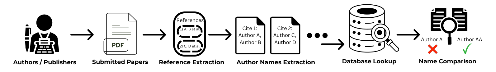

# Academic Paper Processing Toolkit

Two-stage pipeline aligned with the paper methodology:
- **Stage 1 - Citation Extraction**: fetch PDFs, run GROBID full-text (PDF -> TEI), convert TEI to TSV/CSV.
- **Stage 2 - Name Matching**: compare extracted citations against authoritative databases (e.g., DBLP) and optionally classify mismatches with an LLM.

All commands are exposed via one CLI: `python -m src.pipeline ...`.

## Quick Start (per stage)
```bash
python -m venv .venv
. .venv/Scripts/activate   # Windows
pip install -r requirements.txt

# Stage 1 (GROBID only needed for the grobid step)
python -m src.pipeline download --output-dir data/arxiv_pdfs
python -m src.pipeline grobid   --input-dir data/arxiv_pdfs --output-dir data/outputs/arxiv_pdfs
python -m src.pipeline parse    --input-dir data/outputs/arxiv_pdfs --pattern "*.grobid.tei.xml" --output-csv data/arxiv_metadata.csv

# Stage 2
python -m src.pipeline validate --input-dir data/parsed_jsons --dblp-xml data/dblp.xml --output-dir validation_results
# Optional LLM classification
python -m src.pipeline classify --input_file validation_results/validation_results.json --output_file validation_results/classified_results.json
```

## Pipeline overview
Stage 1 - Citation extraction (requires running GROBID for `grobid`)
- `download` - `src.citation_extraction.arxiv_fetcher`
- `grobid` - `src.citation_extraction.grobid_runner`
- `parse` - `src.citation_extraction.grobid_parser`

Stage 2 - Name matching (no GROBID needed)
- `validate` - `src.name_matching.validate_citations`
- `classify` (optional) - `src.models.vllm_classifier`



## Repository map (roles)
```
src/pipeline.py                     # CLI entrypoint
src/citation_extraction/            # Stage 1: PDF -> TEI/TSV
  arxiv_fetcher.py
  grobid_runner.py
  grobid_parser.py
  dblp_scraper.py
src/name_matching/                  # Stage 2: DB lookups & validation
  api_caller.py
  analyze_matches.py
  validate_citations.py
  semantic_scholar.py
src/models/                         # Optional LLM classification
  prompt.py
  vllm_classifier.py
src/parser/dblp_parser.py           # Shared DBLP utilities
examples/                           # Demos & sample outputs
docs/refcheck_updated.png           # Pipeline graphic (inline preview)
docs/refcheck_updated.pdf           # High-res PDF version of the pipeline graphic
validation_results/                 # Outputs written by validate/classify
requirements.txt
```

## Core commands & scripts
- `python -m src.pipeline download` - download PDFs from arXiv using DBLP metadata (fuzzy matching, resumable).
- `python -m src.pipeline grobid` - run GROBID full-text over PDFs (needs running GROBID service).
- `python -m src.pipeline parse` - convert TEI XML to TSV/CSV.
- `python -m src.pipeline validate` - match citations against DBLP; produces `validation_results.json`.
- `python -m src.pipeline classify` - optional LLM-based classification of mismatches.

## Examples
- `examples/api_caller_demo.py` - multi-source search (DBLP/arXiv/Semantic Scholar); writes `api_caller_sample*.json`.
- `examples/dblp_parser_demo.py` - small DBLP lookups against a local XML; writes `dblp_parser_sample.json`.

## Configuration
- **GROBID**: pass server URL/port via environment or grobid_client defaults; if you keep a config file, point `--config-path` to it (default `config/config.json` if you create one). Start GROBID, e.g.  
  `docker run --rm --init -p 8070:8070 grobid/grobid:0.8.0`
- **Semantic Scholar API key**: set `SEMANTIC_SCHOLAR_API_KEY` in `.env` (copy `.env.example`).

## Dependencies
- Core: arxiv, requests, fuzzywuzzy (+python-Levenshtein), nameparser, python-dotenv, tqdm, rapidfuzz, unidecode, retriv, grobid-client, pandas, numpy, matplotlib.
- Optional (LLM): torch, huggingface_hub, vllm.

## Notes & limitations
- GROBID is only needed for the `grobid` step; later steps work on existing TEI/TSV/JSON data.
- API rate limits (arXiv, DBLP, Semantic Scholar) apply; built-in throttling is basic.
- Large runs (PDF download + GROBID) can be slow—run per conference/year if needed.
